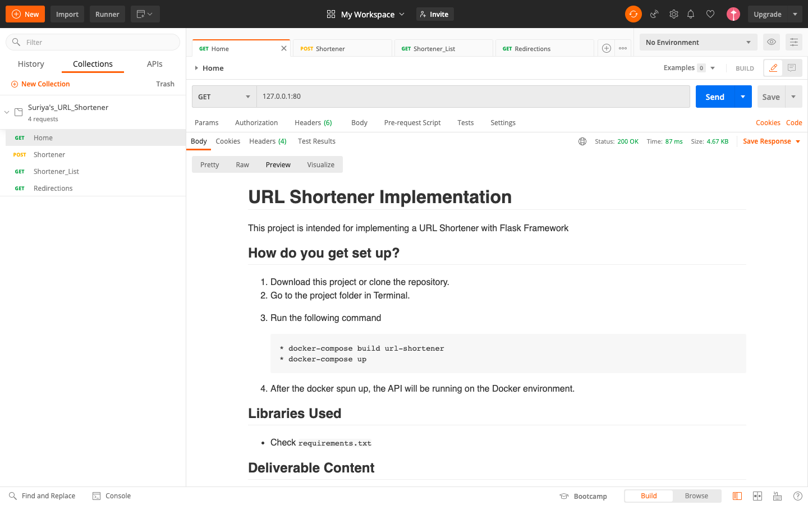
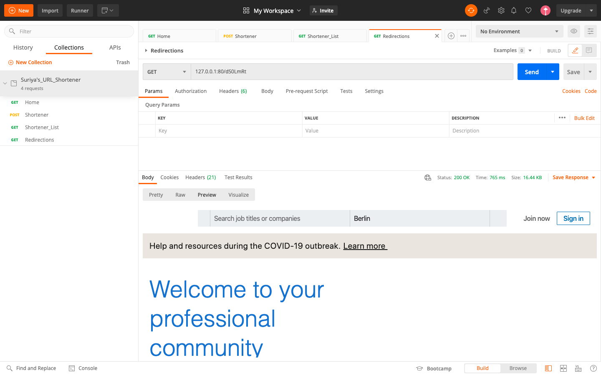

# URL Shortener Implementation #
This project is intended for implementing a URL Shortener with Flask Framework


## How do you get set up? ##
1. Download this project or clone the repository.
2. Go to the project folder in Terminal.
3. Run the following command

        * make build
        * make start
        
4. After the docker spun up, the API will be running on the Docker environment.
5. To run the unit testcases

        * make test
        
6. To stop the service

        * make stop

## Libraries Used ##

- Check `requirements.txt`

## Deliverable Content ##

#### 1. Index or Homepage ####
**Definition**

`GET /`

**Response**



#### 2. Adding the URL ####
**Definition**

`POST /shortener/<long_url>`

**Arguments**

- `"long_url":string` input long url for the shortening

**Response**

- 400: Validation errors in Input
- 500: Invalid Input Key
- 200: Success

```json
{
  "body": {
    "message": "http://www.linkedin.com",
    "response_output": "https://tier.app/dS0LmRt",
    "status": 200
  },
  "headers": {
    "Access-Control-Allow-Credentials": "True",
    "Access-Control-Allow-Origin": "*",
    "Content-Type": "application/json"
  },
  "statusCode": 200
}
```

#### 3. List the Shortened URL with some statistics ####
**Definition**

`GET /shortener/list`

**Response**

- 200: Success

```json
{
  "body": {
    "message": "List of URL Shortener",
    "response_output": [
      {
        "date_Created": "Thu, 17 Sep 2020 09:58:35 GMT",
        "hits": 4,
        "id": 1,
        "long_url": "http://www.google.com",
        "short_url": "lViANht"
      },
      {
        "date_Created": "Thu, 17 Sep 2020 12:52:59 GMT",
        "hits": 0,
        "id": 2,
        "long_url": "http://www.youtube.com",
        "short_url": "8mLtIR0"
      },
      {
        "date_Created": "Thu, 17 Sep 2020 12:59:32 GMT",
        "hits": 0,
        "id": 3,
        "long_url": "http://www.linkedin.com",
        "short_url": "dS0LmRt"
      }
    ],
    "status": 200
  },
  "headers": {
    "Access-Control-Allow-Credentials": "True",
    "Access-Control-Allow-Origin": "*",
    "Content-Type": "application/json"
  },
  "statusCode": 200
}
```

#### 4. Redirection to the long URL from short url ####
**Definition**

`GET /<short_url>`

**Arguments**

- `"short_url":string` input short url for the redirection

**Response**

- 404: Invalid Input of Short URL or Page Not Found

**Output**




## Distribution ##
- A git repository
- A postman collection: https://www.postman.com/collections/880333e810dd4ade690b


## Contribution guidelines ##
- Forks are always appreciated


 
         
      
 
